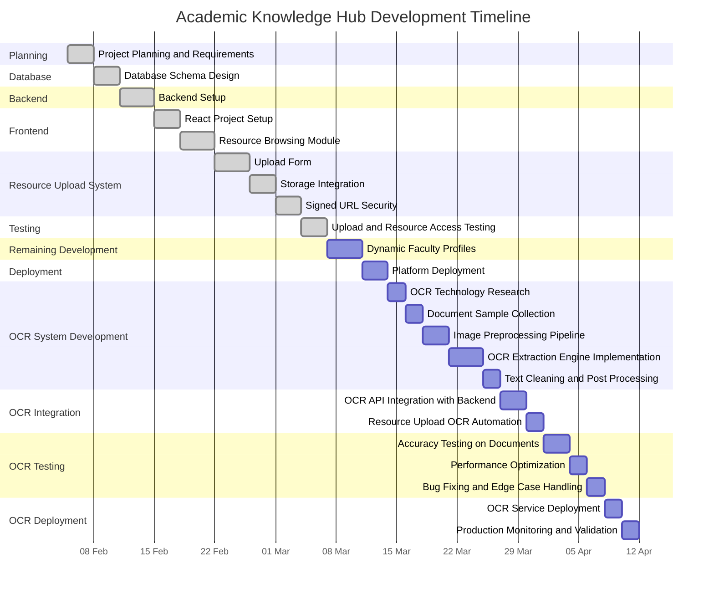

```mermaid
gantt
    title Academic Knowledge Hub Development Timeline
    dateFormat YYYY-MM-DD
    axisFormat %d %b

    section Planning
    Project Planning and Requirements :done, a1, 2026-02-05, 3d

    section Database
    Database Schema Design :done, a2, after a1, 3d

    section Backend
    Backend Setup :done, a3, after a2, 4d

    section Frontend
    React Project Setup :done, a4, after a3, 3d
    Resource Browsing Module :done, a5, after a4, 4d

    section Resource Upload System
    Upload Form :done, a6, after a5, 4d
    Storage Integration :done, a7, after a6, 3d
    Signed URL Security :done, a8, after a7, 3d

    section Testing
    Upload and Resource Access Testing :done, a9, after a8, 3d

    section Remaining Development
    Dynamic Faculty Profiles :a10, after a9, 4d

    section Deployment
    Platform Deployment :a11, after a10, 3d

    section OCR System Development
    OCR Technology Research :a12, after a11, 2d
    Document Sample Collection :a13, after a12, 2d
    Image Preprocessing Pipeline :a14, after a13, 3d
    OCR Extraction Engine Implementation :a15, after a14, 4d
    Text Cleaning and Post Processing :a16, after a15, 2d

    section OCR Integration
    OCR API Integration with Backend :a17, after a16, 3d
    Resource Upload OCR Automation :a18, after a17, 2d

    section OCR Testing
    Accuracy Testing on Documents :a19, after a18, 3d
    Performance Optimization :a20, after a19, 2d
    Bug Fixing and Edge Case Handling :a21, after a20, 2d

    section OCR Deployment
    OCR Service Deployment :a22, after a21, 2d
    Production Monitoring and Validation :a23, after a22, 2d
```